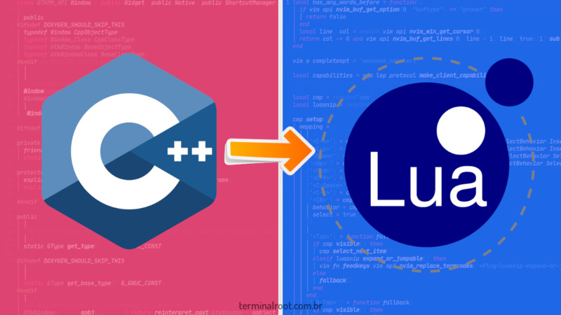

# cpp-bind-lua
Basic examples of how to use the Lua API for C or C++ and export functions written in C/C++ to the Lua programming language.

 

---

# Building
```bash
git clone https://github.com/terroo/cpp-bind-lua
cd cpp-bind-lua
g++ lua-bind.cpp -shared -fpic -llua -o terroo.so
lua main.lua
```

Example of how to compile on Windows
```ps1
g++ lua-bind.cpp -shared -fpic -L C:\path\to\lua.h -L C:\path\to\lauxlib.h -o terroo.dll
lua main.lua
```

For more information [watch this video](https://cutt.ly/z19JuRW).
> Video is in Portuguese.
